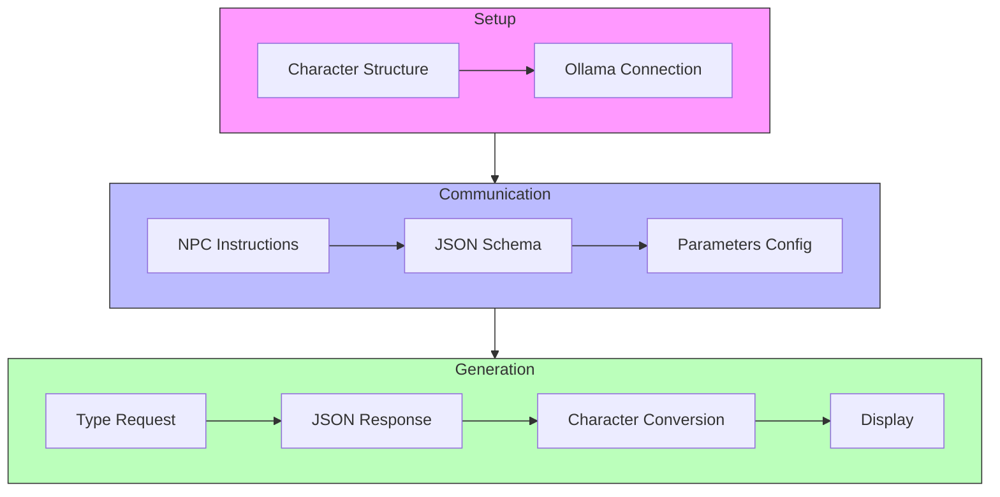

# Comment générer des noms aléatoires de personnage de Jeux de Rôle avec un LLM

J'animais il y a peu un workshop qui consistait à développer des outils d'aide de jeu pour du jeu de rôle basés sur des LLM. Un de ces outils permettait de générer un nom aléatoire de personnage en fonction de sa race dans le jeu (Elf, Humain, Nain ...). Mais nous nous sommes rapidement aperçus que nous obtenions tous les mêmes noms (sur des machines différentes) et même en relançant le programme.

Dans ce blog post, nous allons chercher comment améliorer la qualité de la génération des noms en originalité et obtenir des résultats plus aléatoires. Nous utiliserons des petits (et des très petits) LLMs pour ces expérimentations:

- [`qwen2.5:0.5b`](https://ollama.com/library/qwen2.5:0.5b) taille: 398 MB
- [`qwen2.5:1.5b`](https://ollama.com/library/qwen2.5:1.5b) taille: 986 MB
- [`qwen2.5:3b`](https://ollama.com/library/qwen2.5:3b) taille: 1.9 GB
- [`nemotron-mini:4b`](https://ollama.com/library/nemotron-mini:4b) taille: 2.7 GB

> n'oubliez pas de les installer


Mais tout d'abord, jetons un coup d'oeil à mon programme de génération de noms.

## Générer un nom de personnage

Ce programme est un générateur de noms de personnages (NPC) pour des jeux de rôle comme D&D :

1. Structure et configuration :
- Définit une structure `Character`
- Se connecte à Ollama

2. Communication avec l'IA :
- Envoie des instructions pour générer des noms de personnages
- Spécifie un schéma JSON pour obtenir une réponse structurée
- Configure des paramètres comme la température et les pénalités de répétition

3. Génération :
- Demande à l'IA de générer un nom pour un type spécifique (Humain, Elfe ou Nain)
- Reçoit la réponse au format JSON
- Convertit le JSON en objet Character
- Affiche le nom et le type générés



Voici donc le code de génération en Go:

```golang
type Character struct {
	Name string `json:"name"`
	Kind string `json:"kind"`
}

func main() {

	ctx := context.Background()

	ollamaUrl := os.Getenv("OLLAMA_HOST")
	model := os.Getenv("LLM")

	fmt.Println("🌍", ollamaUrl, "📕", model)

	client, err := api.ClientFromEnvironment()
	if err != nil {
		log.Fatal("😡:", err)
	}

	systemInstructions := `You are an expert NPC generator for games like D&D. 
	You have freedom to be creative to get the best possible output.
	`
	// define schema for a structured output
	// ref: https://ollama.com/blog/structured-outputs
	schema := map[string]any{
		"type": "object",
		"properties": map[string]any{
			"name": map[string]any{
				"type": "string",
			},
			"kind": map[string]any{
				"type": "string",
			},
		},
		"required": []string{"name", "kind"},
	}

	jsonModel, err := json.Marshal(schema)
	if err != nil {
		log.Fatalln("😡", err)
	}

	//kind := "Dwarf"
	kind := "Human"
	//kind := "Elf"
	userContent := fmt.Sprintf("Generate a random name for an %s (kind always equals %s).", kind, kind)

	// Prompt construction
	messages := []api.Message{
		{Role: "system", Content: systemInstructions},
		{Role: "user", Content: userContent},
	}

	//stream := true
	noStream := false

	req := &api.ChatRequest{
		Model:    model,
		Messages: messages,
		Options: map[string]interface{}{
			"temperature":    0.0,
			"repeat_last_n":  2,
			"repeat_penalty": 2.2,
			"top_k":          10,
			"top_p":          0.5,
		},
		Format: json.RawMessage(jsonModel),
		Stream: &noStream,
	}

	generateName := func() (string, error) {
		jsonResult := ""
		respFunc := func(resp api.ChatResponse) error {
			jsonResult = resp.Message.Content
			return nil
		}
		// Start the chat completion
		err := client.Chat(ctx, req, respFunc)
		if err != nil {
			return jsonResult, err
		}
		return jsonResult, nil
	}
	// call talkToLLM 5 times
	jsonStr, err := generateName()
	if err != nil {
		log.Fatal("😡:", err)
	}
	character := Character{}

	err = json.Unmarshal([]byte(jsonStr), &character)
	if err != nil {
		log.Fatal("😡:", err)
	}
	
	fmt.Println(character.Name, character.Kind)

}
```

J'exécute le programme plusieurs fois en utilisant le LLM [`qwen2.5:0.5b`](https://ollama.com/library/qwen2.5:0.5b):

```bash
OLLAMA_HOST=http://localhost:11434 \
LLM=qwen2.5:0.5b \
go run main.go
```

à chaque fois, j'obtiens:

```text
Ethan Human
```

Si je tente avec une version un peu plus grosse [`qwen2.5:1.5b`](https://ollama.com/library/qwen2.5:1.5b):

```bash
OLLAMA_HOST=http://localhost:11434 \
LLM=qwen2.5:1.5b \
go run main.go
```

j'obtiens:

```text
Aurora Kind Aurora
```

Et si je relance plsuieurs fois j'obtiens le même nom. Et j'aurais le même type de comportement avec [`qwen2.5:3b`](https://ollama.com/library/qwen2.5:3b). Donc à priori, la taille du modèle ne semble pas avoir un impact fort sur l'aspect aléatoire de la génération (mais peut être sur l'originalité du nom).

Voyons maintenant comment nous pourrions influencer le comportement du LLM.

## Générer un nom de personnage, jouons avec les options

Modifions les paramètres du LLM pour tenter d'améliorer le côté aléatoire de la génération:

```golang
Options: map[string]interface{}{
    "temperature":    1.7,
    "repeat_last_n":  2,
    "repeat_penalty": 2.2,
    "top_k":          10,
    "top_p":          0.9,
},
```

J'ai donc augmenté la `temperature` pour améliorer la créativité. J'ai aussi joué avec `top_p` qui sert à garder une certaine cohérence, et je l'ai augmenté légèrement pour permettre la créativité.

Et une fois de plus j'ai essayé avec `qwen2.5:0.5b`:

```bash
OLLAMA_HOST=http://localhost:11434 \
LLM=qwen2.5:0.5b \
go run main.go
```

Et à chaque relance j'ai obtenu un nouveau nom :

```text
Maggie Brown Human
Marius Human
Rexa Human
```

Ensuite avec `qwen2.5:3b`:

```text
Ethan Thorne Human
Eldric Flintwhistle Human
Ethan Valor Human
Ethan Renwick Human
```

Les résultats semblent, encore une fois plus originaux, inventifs lorsque le modèle est plus gros. Je pourrais probablement améliorer mon prompt pour aider le LLM dans sa génération, mais peut-être existe-t-il des modèles mieux entraînés pour ce genre de tâches.

Jetons un coup d'oeil à [`nemotron-mini:4b`](https://ollama.com/library/nemotron-mini:4b)

## Changeons encore une fois de modèle

Donc avec le même code source, les même paramètres, voyons voir comment se comporte `nemotron-mini` qui semble avoir quelques capacités dans le domaine du "roleplay". Il aurait donc la capacité d'incarner des personnages fictifs.

```bash
OLLAMA_HOST=http://localhost:11434 \
LLM=nemotron-mini:4b \
go run main.go
```

Et en lançant le programme plusieurs fois, j'obtiens successivement:

```text
Aurelius Silvermoon Human
Valeira Human
Aurelia Human
Elara Human
Erin Human
```

Cela semble plutôt pas mal. Mais étant curieux de savoir des modèles `qwen2.5` et du modèle `nemotron-mini` lequel est le plus "doué", j'ai modifié mon programme pour qu'il exécute automatiquement un certain nombre de fois la demande de génération de nom et sauvegarde les résultats.

## Génération de noms par lots

Voici la modification apportée au code (j'appelle 15 fois la fonction de génération):

```golang
characters := []Character{}
for i := 0; i < 15; i++ {
    // Generate a random name
    jsonStr, err := generateName()
    if err != nil {
        log.Fatal("😡:", err)
    }
    character := Character{}

    err = json.Unmarshal([]byte(jsonStr), &character)
    if err != nil {
        log.Fatal("😡:", err)
    }
    fmt.Println(character.Name, character.Kind)

    characters = append(characters, character)
}

// Create a Markdown table
markdownTable := "| Index | Name     | Kind       |\n"
markdownTable += "|------|----------|------------|\n"

// Add rows to the Markdown table
for idx, character := range characters {
    markdownTable += fmt.Sprintf("| %d   | %s      | %s       |\n", idx+1, character.Name, character.Kind)
}

// Write the Markdown table to a file
err = os.WriteFile("./characters."+kind+".md", []byte(markdownTable), 0644)
if err != nil {
    log.Fatal("😡:", err)
}
```

## Résultats des générations par lot

### `qwen2.5:0.5b`

```bash
OLLAMA_HOST=http://localhost:11434 \
LLM=qwen2.5:0.5b \
go run main.go
```

| Index | Name     | Kind       |
|------|----------|------------|
| 1   | Dwarven King       |  Dwarf        |
| 2   | Gandalf      | Dwarf       |
| 3   | Elvenhal      | dwarf       |
| 4   | Krym      | dwarf       |
| 5   | Gornath      | Dwarf       |
| 6   | Dawn      | Dwarf       |
| 7   | Bramble      | Dwarf       |
| 8   | Valkyrie Gnome      | Dwarf       |
| 9   | Boradric the Dwarf      | Dwarf       |
| 10   | Gorilla Dwarf      | Dwarf       |
| 11   | Dwarven Knight      |  Dwarf       |
| 12   | Elven Elbow      |  Dwarf       |
| 13   | Baldur      | Dwarf       |
| 14   | Dweller      | dwarf       |
| 15   | Elder Frostbite      | Dwarf       |


### `qwen2.5:1.5b`

```bash
OLLAMA_HOST=http://localhost:11434 \
LLM=qwen2.5:1.5b \
go run main.go
```

| Index | Name     | Kind       |
|------|----------|------------|
| 1   | Orcus Stonefur      | Dwarf       |
| 2   | Orelyth      | Dwarf       |
| 3   | Mithrandir      | Dwarf       |
| 4   | Grimmhammer      | Dwarf       |
| 5   | Olivier      | Dwarf       |
| 6   | DwarfintheGreenThicket      | Dwarf       |
| 7   | Thaurin      | Dwarf       |
| 8   | Thranduin      | Dwarf       |
| 9   | Thranduil      | Dwarf       |
| 10   | Lorwynth      | Auril       |
| 11   | Threnadel      | Nimble       |
| 12   | Glenvor      | Dwarf       |
| 13   | Mithril      | Dwarf       |
| 14   | Rudric the Blackhammer      | Dwarf       |
| 15   | Mikaela'vaar      | Dwarf       |

### `qwen2.5:3b`

```bash
OLLAMA_HOST=http://localhost:11434 \
LLM=qwen2.5:3b \
go run main.go
```

| Index | Name     | Kind       |
|------|----------|------------|
| 1   | Grog Thunderjaw      | Dwarf       |
| 2   | Grommek Stouthammer      | Dwarf       |
| 3   | Karngrim Stonehammer      | Dwarf       |
| 4   | Thorgar Stonehammer      | Dwarf       |
| 5   | Korvath Ironclaw      | Dwarf       |
| 6   | Grolgar Blackclaw      | Dwarf       |
| 7   | Gromthunderblast      | Dwarf       |
| 8   | Krogsharn Blackfrost      | Dwarf       |
| 9   | Grimstone Stouthammer      | Dwarf       |
| 10   | Kromberg Ironfoot      | Dwarf       |
| 11   | Grommash Boulderjaw      | Dwarf       |
| 12   | Grondulf the Grim      | Dwarf       |
| 13   | Grundgrond the Boulderborn      | Dwarf       |
| 14   | Kraggthor      | Dwarf       |
| 15   | Gorogthar the Grim      | Dwarf       |

### `nemotron-mini:4b`

```bash
OLLAMA_HOST=http://localhost:11434 \
LLM=nemotron-mini \
go run main.go
```

| Index | Name     | Kind       |
|------|----------|------------|
| 1   | Grinchbeard      | dwarf       |
| 2   | Gimli the Stout      | Dwarf       |
| 3   | Griphstone      | Dwarf       |
| 4   | Thrall the Stout      | Dwarf       |
| 5   | Tristram Stoutheart      | Dwarf       |
| 6   | Gimli Oakheart      | Dwarf       |
| 7   | Thorin Stonefoot      | Dwarf       |
| 8   | Gimli Oakbeard      | Dwarf       |
| 9   | Gimli Ironhide      | Dwarf       |
| 10   | Oakbeard      | Dwarf       |
| 11   | Grimbeard the Stout      | dwarf       |
| 12   | Grimhammer      | Dwarf       |
| 13   | Thor's Hammer      | Dwarf       |
| 14   | Ironheart      | Dwarf       |
| 15   | Oakbeard Oakthunder      | Dwarf       |


Personnellement, après ces 1ers tests, je trouve que celui qui propose les meilleurs résultats, tant d'un point de vue de la génération aléatoire que de l'originialité, est `qwen2.5:1.5b`. Mais cela reste très subjectif. Mais on peut retenir qu'en jouant avec les paramètres du modèle il est facile d'obtenir une liste de noms aléatoire et que l'on gagnera en originalité selon le modèle choisi.

Ensuite pour éviter les répétitions, nous pourrions éventuellement conserver les générations de nom précédentes dans la liste des messages à envoyer au LLM (la mémoire conversationnelle) et préciser à celui-ci de ne pas générer un nom existant déjà dans sa mémoire.

## Fabriquons un meilleur prompt

J'ai ensuite tenté de donner plus d'instructions au modèle en lui proposant des règles de création:

```golang
generationInstructions := `
## Suggested Generation Rules

For generating consistent names, here are some guidelines:

### Dwarves
- Favor hard consonants (k, t, d, g)
- Use short, punchy sounds
- Incorporate references to metals, stones, forging
- Clan names often hyphenated or compound words
- Common suffixes: -in, -or, -ar, -im

### Elves
- Favor fluid consonants (l, n, r)
- Use many vowels
- Incorporate nature and star references
- Names typically long and melodious
- Common prefixes: El-, Cel-, Gal-
- Common suffixes: -il, -iel, -or, -ion

### Humans
- Greater variety of sounds
- Mix of short and long names
- Can borrow elements from other races
- Family names often descriptive or location-based
- Common suffixes: -or, -wyn, -iel
- Common prefixes: Theo-, El-, Ar-	

## Usage Notes
Names can be modified or combined to create new variations while maintaining the essence of each race.

### Pattern Examples
- Dwarf: [Hard Consonant] + [Short Vowel] + [Hard Consonant] + [Suffix]
- Elf: [Nature Word] + [Fluid Consonant] + [Long Vowel] + [Melodic Ending]
- Human: [Strong Consonant] + [Vowel] + [Cultural Suffix]

### Cultural Considerations
- Dwarf names often reflect their crafts or achievements
- Elf names might change throughout their long lives
- Human names vary by region and social status
`
```

Et je rajoute ces nouvelles instructions à la liste des messages à envoyer au LLM:

```golang
// Prompt construction
messages := []api.Message{
    {Role: "system", Content: systemInstructions},
    {Role: "system", Content: generationInstructions},
    {Role: "user", Content: userContent},
}
```

Relançons le programme de génération de noms par lot avec nos 4 modèles:

### Nouveaux résultats des générations par lot

#### `qwen2.5:0.5b`

| Index | Name     | Kind       |
|------|----------|------------|
| 1   | Dwarven Valtor      | Dwarf       |
| 2   | Elmaron      | Dwarf       |
| 3   | Dwarvix      | Dwarf       |
| 4   | Khan-El-Tanar      | Dwarf       |
| 5   | Gryph      | Dwarf       |
| 6   | Karl      | knight       |
| 7   | Gryphon      | Dwarf       |
| 8   | Fernilla      | Dwarf       |
| 9   | Kinden      | kind       |
| 10   | Darth Kael      | Dwarf       |
| 11   | Kaelinor      | Dwarf       |
| 12   | Eonwind      | Dwarf       |
| 13   | Eon-      | Dwarf       |
| 14   | El'karth      | dwarf       |
| 15   | Gaelion      | Dwarf       |

#### `qwen2.5:1.5b`

| Index | Name     | Kind       |
|------|----------|------------|
| 1   | Threnadinor Steelhammer      | Dwarf       |
| 2   | Thaklinor Durin      | Dwarf       |
| 3   | Rukhkar      | Dwarf       |
| 4   | Thornkin      | Dwarf       |
| 5   | Thakran      | Dwarf       |
| 6   | Rukk      | Dwarf       |
| 7   | Thrain      | Dwarf       |
| 8   | Makin      | Dwarf       |
| 9   | Roran Ironhand      | Dwarf       |
| 10   | Kaelin Stoneforger      | Dwarf       |
| 11   | Thaurik      | Dwarf       |
| 12   | Mikaelin Stoneforger      | Dwarf       |
| 13   | Rukhkar      | Dwarf       |
| 14   | Kaelthorin      | Dwarf       |
| 15   | Korthin      | Dwarf       |


#### `qwen2.5:3b`

| Index | Name     | Kind       |
|------|----------|------------|
| 1   | Kornin      | Dwarf       |
| 2   | Kilgorin      | Dwarf       |
| 3   | Grimmett-in      | Dwarf       |
| 4   | Kornin      | Dwarf       |
| 5   | Gol-Durin      | Dwarf       |
| 6   | Kor-darion      | Dwarf       |
| 7   | Glim-Dun-in      | Dwarf       |
| 8   | Grimmet-in      | Dwarf       |
| 9   | Kilmarin-dor      | Dwarf       |
| 10   | Grik-dor      | Dwarf       |
| 11   | Kronar-dim      | Dwarf       |
| 12   | Grik-Dor      | Dwarf       |
| 13   | Kilorin-dagor      | Dwarf       |
| 14   | Glimm-knir      | Dwarf       |
| 15   | Glim-Driv      | Dwarf       |


#### `nemotron-mini:4b`

| Index | Name     | Kind       |
|------|----------|------------|
| 1   | Ironheart      | Dwarf       |
| 2   | Tombstone Forge-Fist      | dwarf       |
| 3   | Thundergrail-Bristle      | Dwarf       |
| 4   | Khorne-Thumbed      | dwarf       |
| 5   | Stonehammer Ironbeard      | dwarf       |
| 6   | Ironhand Gorm      | Dwarf       |
| 7   | Gron'karrin-Grunthor      | Dwarf       |
| 8   | Grunthor Ironclaw      | Dwarf       |
| 9   | Ironforge      | dwarf       |
| 10   | Grunthorn-Steel      | Dwarf       |
| 11   | Ironhammer      | Dwarf       |
| 12   | Tinkering Thor      | dwarf       |
| 13   | Hardrock      | Dwarf       |
| 14   | Grunthor Stonefist      | Dwarf       |
| 15   | Bolt-Iron      | Dwarf       |

Cette fois-ci je trouve qu'il y a une nette amélioration pour les 2 plus petits LLM `qwen2.5:0.5b` et `qwen2.5:1.5b`. Ce qui est particulièrement intéressant parce que cela confirme que pour certains cas d'usages, il est tout à fait possible de d'utiliser de très petits modèles si on les guide bien et que l'on leur fournit les données appropriées. Ainsi vous gagnerez en efficacité et en consommation énergétiques.

Si vous souhaitez plus de contrôle sur la génération, vous pouvez également jouer avec ces options :

- `frequency_penalty`: pour réduire la répétition de syllabes ou de styles de noms
- `presence_penalty`: pour encourager plus de diversité dans les résultats
- `seed`: pour obtenir des résultats reproductibles si nécessaire

