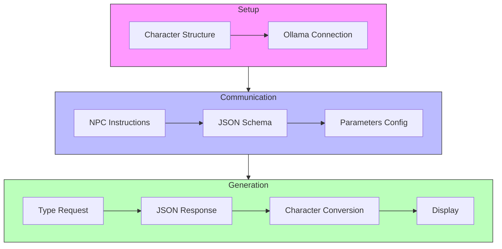

# How to Generate Random RPG Character Names with an LLM

I recently led a workshop on developing LLM-based RPG game tools. One tool was designed to generate random character names based on their in-game race (Elf, Human, Dwarf...). However, we quickly noticed that we were all getting the same names (on different machines) even when rerunning the program.

In this blog post, we'll explore how to improve name generation quality in terms of originality and achieve more random results. We'll use small (and very small) LLMs for these experiments:

- [`qwen2.5:0.5b`](https://ollama.com/library/qwen2.5:0.5b) size: 398 MB
- [`qwen2.5:1.5b`](https://ollama.com/library/qwen2.5:1.5b) size: 986 MB
- [`qwen2.5:3b`](https://ollama.com/library/qwen2.5:3b) size: 1.9 GB
- [`nemotron-mini:4b`](https://ollama.com/library/nemotron-mini:4b) size: 2.7 GB

> don't forget to install them

But first, let's take a look at my name generation program.

## Generating a Character Name

This program is a character name generator (NPC) for RPGs like D&D:

1. Structure and configuration:
- Defines a `Character` structure
- Connects to Ollama

2. AI Communication:
- Sends instructions to generate character names
- Specifies JSON schema for structured response
- Configures parameters like temperature and repetition penalties

3. Generation:
- Asks AI to generate a name for a specific type (Human, Elf, or Dwarf)
- Receives JSON response
- Converts JSON to Character object
- Displays generated name and type



Here's the Go generation code:

```golang
type Character struct {
	Name string `json:"name"`
	Kind string `json:"kind"`
}

func main() {

	ctx := context.Background()

	ollamaUrl := os.Getenv("OLLAMA_HOST")
	model := os.Getenv("LLM")

	fmt.Println("🌍", ollamaUrl, "📕", model)

	client, err := api.ClientFromEnvironment()
	if err != nil {
		log.Fatal("😡:", err)
	}

	systemInstructions := `You are an expert NPC generator for games like D&D. 
	You have freedom to be creative to get the best possible output.
	`
	// define schema for a structured output
	// ref: https://ollama.com/blog/structured-outputs
	schema := map[string]any{
		"type": "object",
		"properties": map[string]any{
			"name": map[string]any{
				"type": "string",
			},
			"kind": map[string]any{
				"type": "string",
			},
		},
		"required": []string{"name", "kind"},
	}

	jsonModel, err := json.Marshal(schema)
	if err != nil {
		log.Fatalln("😡", err)
	}

	//kind := "Dwarf"
	kind := "Human"
	//kind := "Elf"
	userContent := fmt.Sprintf("Generate a random name for an %s (kind always equals %s).", kind, kind)

	// Prompt construction
	messages := []api.Message{
		{Role: "system", Content: systemInstructions},
		{Role: "user", Content: userContent},
	}

	//stream := true
	noStream := false

	req := &api.ChatRequest{
		Model:    model,
		Messages: messages,
		Options: map[string]interface{}{
			"temperature":    0.0,
			"repeat_last_n":  2,
			"repeat_penalty": 2.2,
			"top_k":          10,
			"top_p":          0.5,
		},
		Format: json.RawMessage(jsonModel),
		Stream: &noStream,
	}

	generateName := func() (string, error) {
		jsonResult := ""
		respFunc := func(resp api.ChatResponse) error {
			jsonResult = resp.Message.Content
			return nil
		}
		// Start the chat completion
		err := client.Chat(ctx, req, respFunc)
		if err != nil {
			return jsonResult, err
		}
		return jsonResult, nil
	}
	// call talkToLLM 5 times
	jsonStr, err := generateName()
	if err != nil {
		log.Fatal("😡:", err)
	}
	character := Character{}

	err = json.Unmarshal([]byte(jsonStr), &character)
	if err != nil {
		log.Fatal("😡:", err)
	}
	
	fmt.Println(character.Name, character.Kind)

}
```

Running the program multiple times using [`qwen2.5:0.5b`](https://ollama.com/library/qwen2.5:0.5b):

```bash
OLLAMA_HOST=http://localhost:11434 \
LLM=qwen2.5:0.5b \
go run main.go
```

Each time, I get:
```text
Ethan Human
```

Trying with a slightly larger version [`qwen2.5:1.5b`](https://ollama.com/library/qwen2.5:1.5b):

```bash
OLLAMA_HOST=http://localhost:11434 \
LLM=qwen2.5:1.5b \
go run main.go
```

I get:
```text
Aurora Kind Aurora
```

Running it multiple times yields the same name. Similar behavior occurs with [`qwen2.5:3b`](https://ollama.com/library/qwen2.5:3b). So model size doesn't seem to significantly impact generation randomness (though it might affect name originality).

Let's see how we could influence the LLM's behavior.

## Generating a Character Name: Playing with Options

Let's modify the LLM parameters to improve generation randomness:

```golang
Options: map[string]interface{}{
    "temperature":    1.7,
    "repeat_last_n":  2,
    "repeat_penalty": 2.2,
    "top_k":          10,
    "top_p":          0.9,
},
```

I increased `temperature` to enhance creativity and adjusted `top_p`, which maintains coherence, slightly upward to allow for more creativity.

Testing again with `qwen2.5:0.5b`:

```bash
OLLAMA_HOST=http://localhost:11434 \
LLM=qwen2.5:0.5b \
go run main.go
```

Each run produced a new name:

```text
Maggie Brown Human
Marius Human
Rexa Human
```

Then with `qwen2.5:3b`:

```text
Ethan Thorne Human
Eldric Flintwhistle Human
Ethan Valor Human
Ethan Renwick Human
```

Results appear more original and inventive with the larger model. While I could improve my prompt to help the LLM's generation, there might be models better trained for such tasks.

Let's look at [`nemotron-mini:4b`](https://ollama.com/library/nemotron-mini:4b)

## Let's Change Models Again

With identical source code and parameters, let's examine `nemotron-mini`, which appears to have some "roleplay" capabilities and the ability to embody fictional characters.

```bash
OLLAMA_HOST=http://localhost:11434 \
LLM=nemotron-mini:4b \
go run main.go
```

Running the program multiple times yields:

```text
Aurelius Silvermoon Human
Valeira Human
Aurelia Human
Elara Human
Erin Human
```

The results look promising. Curious about which model between `qwen2.5` and `nemotron-mini` is more "skilled," I modified my program to automatically generate names multiple times and save the results.

## Batch Name Generation

Code modification (calling the generation function 15 times):


```golang
characters := []Character{}
for i := 0; i < 15; i++ {
    // Generate a random name
    jsonStr, err := generateName()
    if err != nil {
        log.Fatal("😡:", err)
    }
    character := Character{}

    err = json.Unmarshal([]byte(jsonStr), &character)
    if err != nil {
        log.Fatal("😡:", err)
    }
    fmt.Println(character.Name, character.Kind)

    characters = append(characters, character)
}

// Create a Markdown table
markdownTable := "| Index | Name     | Kind       |\n"
markdownTable += "|------|----------|------------|\n"

// Add rows to the Markdown table
for idx, character := range characters {
    markdownTable += fmt.Sprintf("| %d   | %s      | %s       |\n", idx+1, character.Name, character.Kind)
}

// Write the Markdown table to a file
err = os.WriteFile("./characters."+kind+".md", []byte(markdownTable), 0644)
if err != nil {
    log.Fatal("😡:", err)
}
```

## Batch Generation Results

### `qwen2.5:0.5b`

```bash
OLLAMA_HOST=http://localhost:11434 \
LLM=qwen2.5:0.5b \
go run main.go
```

| Index | Name     | Kind       |
|------|----------|------------|
| 1   | Dwarven King       |  Dwarf        |
| 2   | Gandalf      | Dwarf       |
| 3   | Elvenhal      | dwarf       |
| 4   | Krym      | dwarf       |
| 5   | Gornath      | Dwarf       |
| 6   | Dawn      | Dwarf       |
| 7   | Bramble      | Dwarf       |
| 8   | Valkyrie Gnome      | Dwarf       |
| 9   | Boradric the Dwarf      | Dwarf       |
| 10   | Gorilla Dwarf      | Dwarf       |
| 11   | Dwarven Knight      |  Dwarf       |
| 12   | Elven Elbow      |  Dwarf       |
| 13   | Baldur      | Dwarf       |
| 14   | Dweller      | dwarf       |
| 15   | Elder Frostbite      | Dwarf       |


### `qwen2.5:1.5b`

```bash
OLLAMA_HOST=http://localhost:11434 \
LLM=qwen2.5:1.5b \
go run main.go
```

| Index | Name     | Kind       |
|------|----------|------------|
| 1   | Orcus Stonefur      | Dwarf       |
| 2   | Orelyth      | Dwarf       |
| 3   | Mithrandir      | Dwarf       |
| 4   | Grimmhammer      | Dwarf       |
| 5   | Olivier      | Dwarf       |
| 6   | DwarfintheGreenThicket      | Dwarf       |
| 7   | Thaurin      | Dwarf       |
| 8   | Thranduin      | Dwarf       |
| 9   | Thranduil      | Dwarf       |
| 10   | Lorwynth      | Auril       |
| 11   | Threnadel      | Nimble       |
| 12   | Glenvor      | Dwarf       |
| 13   | Mithril      | Dwarf       |
| 14   | Rudric the Blackhammer      | Dwarf       |
| 15   | Mikaela'vaar      | Dwarf       |

### `qwen2.5:3b`

```bash
OLLAMA_HOST=http://localhost:11434 \
LLM=qwen2.5:3b \
go run main.go
```

| Index | Name     | Kind       |
|------|----------|------------|
| 1   | Grog Thunderjaw      | Dwarf       |
| 2   | Grommek Stouthammer      | Dwarf       |
| 3   | Karngrim Stonehammer      | Dwarf       |
| 4   | Thorgar Stonehammer      | Dwarf       |
| 5   | Korvath Ironclaw      | Dwarf       |
| 6   | Grolgar Blackclaw      | Dwarf       |
| 7   | Gromthunderblast      | Dwarf       |
| 8   | Krogsharn Blackfrost      | Dwarf       |
| 9   | Grimstone Stouthammer      | Dwarf       |
| 10   | Kromberg Ironfoot      | Dwarf       |
| 11   | Grommash Boulderjaw      | Dwarf       |
| 12   | Grondulf the Grim      | Dwarf       |
| 13   | Grundgrond the Boulderborn      | Dwarf       |
| 14   | Kraggthor      | Dwarf       |
| 15   | Gorogthar the Grim      | Dwarf       |

### `nemotron-mini:4b`

```bash
OLLAMA_HOST=http://localhost:11434 \
LLM=nemotron-mini \
go run main.go
```

| Index | Name     | Kind       |
|------|----------|------------|
| 1   | Grinchbeard      | dwarf       |
| 2   | Gimli the Stout      | Dwarf       |
| 3   | Griphstone      | Dwarf       |
| 4   | Thrall the Stout      | Dwarf       |
| 5   | Tristram Stoutheart      | Dwarf       |
| 6   | Gimli Oakheart      | Dwarf       |
| 7   | Thorin Stonefoot      | Dwarf       |
| 8   | Gimli Oakbeard      | Dwarf       |
| 9   | Gimli Ironhide      | Dwarf       |
| 10   | Oakbeard      | Dwarf       |
| 11   | Grimbeard the Stout      | dwarf       |
| 12   | Grimhammer      | Dwarf       |
| 13   | Thor's Hammer      | Dwarf       |
| 14   | Ironheart      | Dwarf       |
| 15   | Oakbeard Oakthunder      | Dwarf       |


After these initial tests, I find `qwen2.5:1.5b` offers the best results in terms of both randomness and originality, though this is subjective. 

**Key takeaways**:
- Adjusting model parameters easily yields random name lists
- Model choice affects name originality
- To prevent repetition, we could store previous name generations in the message list (conversation memory) and instruct the LLM to avoid generating existing names

## Let's Build a Better Prompt

I added more detailed generation instructions to the model:

```golang
generationInstructions := `
## Suggested Generation Rules

For generating consistent names, here are some guidelines:

### Dwarves
- Favor hard consonants (k, t, d, g)
- Use short, punchy sounds
- Incorporate references to metals, stones, forging
- Clan names often hyphenated or compound words
- Common suffixes: -in, -or, -ar, -im

### Elves
- Favor fluid consonants (l, n, r)
- Use many vowels
- Incorporate nature and star references
- Names typically long and melodious
- Common prefixes: El-, Cel-, Gal-
- Common suffixes: -il, -iel, -or, -ion

### Humans
- Greater variety of sounds
- Mix of short and long names
- Can borrow elements from other races
- Family names often descriptive or location-based
- Common suffixes: -or, -wyn, -iel
- Common prefixes: Theo-, El-, Ar-	

## Usage Notes
Names can be modified or combined to create new variations while maintaining the essence of each race.

### Pattern Examples
- Dwarf: [Hard Consonant] + [Short Vowel] + [Hard Consonant] + [Suffix]
- Elf: [Nature Word] + [Fluid Consonant] + [Long Vowel] + [Melodic Ending]
- Human: [Strong Consonant] + [Vowel] + [Cultural Suffix]

### Cultural Considerations
- Dwarf names often reflect their crafts or achievements
- Elf names might change throughout their long lives
- Human names vary by region and social status
`
```

Then, I added these new instructions to the LLM message list:

```golang
// Prompt construction
messages := []api.Message{
    {Role: "system", Content: systemInstructions},
    {Role: "system", Content: generationInstructions},
    {Role: "user", Content: userContent},
}
```

Let's run batch name generation with our 4 models:

### New Batch Generation Results


#### `qwen2.5:0.5b`

| Index | Name     | Kind       |
|------|----------|------------|
| 1   | Dwarven Valtor      | Dwarf       |
| 2   | Elmaron      | Dwarf       |
| 3   | Dwarvix      | Dwarf       |
| 4   | Khan-El-Tanar      | Dwarf       |
| 5   | Gryph      | Dwarf       |
| 6   | Karl      | knight       |
| 7   | Gryphon      | Dwarf       |
| 8   | Fernilla      | Dwarf       |
| 9   | Kinden      | kind       |
| 10   | Darth Kael      | Dwarf       |
| 11   | Kaelinor      | Dwarf       |
| 12   | Eonwind      | Dwarf       |
| 13   | Eon-      | Dwarf       |
| 14   | El'karth      | dwarf       |
| 15   | Gaelion      | Dwarf       |

#### `qwen2.5:1.5b`

| Index | Name     | Kind       |
|------|----------|------------|
| 1   | Threnadinor Steelhammer      | Dwarf       |
| 2   | Thaklinor Durin      | Dwarf       |
| 3   | Rukhkar      | Dwarf       |
| 4   | Thornkin      | Dwarf       |
| 5   | Thakran      | Dwarf       |
| 6   | Rukk      | Dwarf       |
| 7   | Thrain      | Dwarf       |
| 8   | Makin      | Dwarf       |
| 9   | Roran Ironhand      | Dwarf       |
| 10   | Kaelin Stoneforger      | Dwarf       |
| 11   | Thaurik      | Dwarf       |
| 12   | Mikaelin Stoneforger      | Dwarf       |
| 13   | Rukhkar      | Dwarf       |
| 14   | Kaelthorin      | Dwarf       |
| 15   | Korthin      | Dwarf       |


#### `qwen2.5:3b`

| Index | Name     | Kind       |
|------|----------|------------|
| 1   | Kornin      | Dwarf       |
| 2   | Kilgorin      | Dwarf       |
| 3   | Grimmett-in      | Dwarf       |
| 4   | Kornin      | Dwarf       |
| 5   | Gol-Durin      | Dwarf       |
| 6   | Kor-darion      | Dwarf       |
| 7   | Glim-Dun-in      | Dwarf       |
| 8   | Grimmet-in      | Dwarf       |
| 9   | Kilmarin-dor      | Dwarf       |
| 10   | Grik-dor      | Dwarf       |
| 11   | Kronar-dim      | Dwarf       |
| 12   | Grik-Dor      | Dwarf       |
| 13   | Kilorin-dagor      | Dwarf       |
| 14   | Glimm-knir      | Dwarf       |
| 15   | Glim-Driv      | Dwarf       |


#### `nemotron-mini:4b`

| Index | Name     | Kind       |
|------|----------|------------|
| 1   | Ironheart      | Dwarf       |
| 2   | Tombstone Forge-Fist      | dwarf       |
| 3   | Thundergrail-Bristle      | Dwarf       |
| 4   | Khorne-Thumbed      | dwarf       |
| 5   | Stonehammer Ironbeard      | dwarf       |
| 6   | Ironhand Gorm      | Dwarf       |
| 7   | Gron'karrin-Grunthor      | Dwarf       |
| 8   | Grunthor Ironclaw      | Dwarf       |
| 9   | Ironforge      | dwarf       |
| 10   | Grunthorn-Steel      | Dwarf       |
| 11   | Ironhammer      | Dwarf       |
| 12   | Tinkering Thor      | dwarf       |
| 13   | Hardrock      | Dwarf       |
| 14   | Grunthor Stonefist      | Dwarf       |
| 15   | Bolt-Iron      | Dwarf       |

**Analysis**:
There is a significant improvement for smaller LLMs `qwen2.5:0.5b` and `qwen2.5:1.5b`. This confirms small models can be effective with proper guidance and appropriate data, offering better efficiency and energy consumption.

For more generation control, consider these options:
- `frequency_penalty`: Reduces syllable/name style repetition
- `presence_penalty`: Encourages result diversity
- `seed`: Enables reproducible results when needed

Source code available at: https://github.com/ollama-tlms-golang/08-random-generation

I hope you enjoyed this article and see you soon.